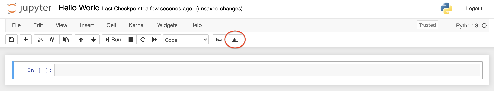

# UAI-1-2021
Curso de Aprendizaje Profundo

Este link permite ver los notebook (jupiter/colab) como presentación, especialmente en la S05 y S06:

https://mybinder.org/v2/gh/jbekios/UAI-1-2021.git/HEAD

    

Listado de sesiones:

*   S01: Introducción y regresión lineal
*   S02: Clasificación lineal y redes poco profundas
*   S03: Redes neuronales convolucionales (CNN) y data augmentation
*   S04: Transfer learning y data augmentation (Continuación)
*   S05: Repaso y redes neuronales recurrentes (RNN)
*   S06: Redes neuronales recurrentes (LSTM) y Redes Generativas (GAN)
